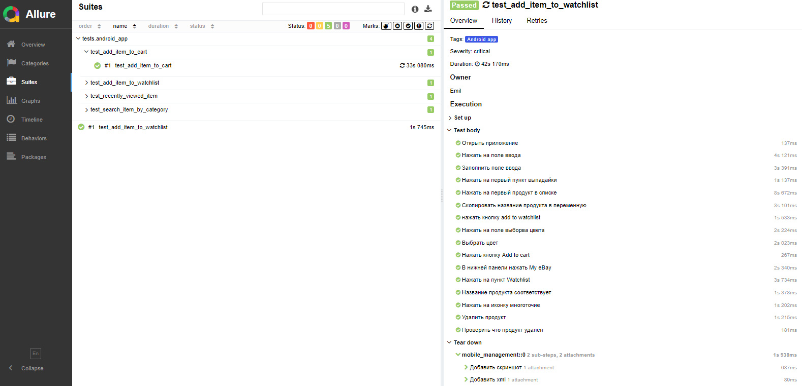

# Учебный проект по тестированию сайта и мобильного приложения eBay


[eBay](https://www.ebay.com/)

## Проект реализован с использованием:

<div style="display: flex; flex-wrap: wrap;">
  
  
  
  
  
  
  
  
  
  
  
</div>

## Web UI

### Список проверок:

✔️ добавление продукта в корзину  
✔️ поиск продукта через главное поле ввода  
✔️ поиск продукта через расширенный поиск  
✔️ поиск продукта через навигационную панель  
✔️ поиск продукта через категории  
✔️ отображение недавно просмотренного продукта

#### Запуск автотестов выполняется в Selenoid через Jenkins

[Проект в Jenkins](https://jenkins.autotests.cloud/job/ebay_project/)

#### Allure report

<style>
  .media-container {
    display: flex;
    justify-content: space-between;
  }

  .media-container img,
  .media-container video {
    width: 48%;
    cursor: pointer;
    transition: transform 0.3s ease;
  }

  .media-container img:hover,
  .media-container video:hover {
    transform: scale(1.05);
  }
</style>

<div class="media-container">
  
  <video controls onclick="openFullscreen(this)">
    <source src="assets/Solinoid.mp4" type="video/mp4">
    Your browser does not support the video tag.
  </video>
</div>

<script>
  function openFullscreen(element) {
    if (element.requestFullscreen) {
      element.requestFullscreen();
    } else if (element.mozRequestFullScreen) { /* Firefox */
      element.mozRequestFullScreen();
    } else if (element.webkitRequestFullscreen) { /* Chrome, Safari & Opera */
      element.webkitRequestFullscreen();
    } else if (element.msRequestFullscreen) { /* IE/Edge */
      element.msRequestFullscreen();
    }
  }
</script>

#### Оповещение о результатах прохождения тестов в Telegram


#### Для локального запуска тестов необходимо выполнить команду в терминале

```
pytest --context=local
```

## Mobile

### Список проверок:

✔️ добавление продукта в корзину  
✔️ добавление продукта в список отслеживаемых  
✔️ отображение недавно просмотренного продукта  
✔️ поиск продукта через категории

#### Тесты выполняются в Android Studio или на реальном девайсе

#### Allure report


